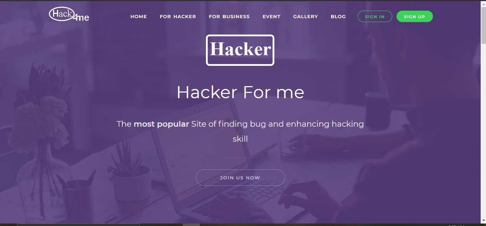

<h1>Installation</h1>

<b>1)Open Terminal Run: <i>composer install</i></b> 

<b>2)Create .env file, copy from .envexample in root folder</b>
   
you will find follwing information

<table>

<tr><th>DB_DATABASE=database name</th></tr>
<tr><th>DB_USERNAME=root</th></tr>
<tr><th>DB_PASSWORD=</th></tr>
</table>

    leave DB_password  empty and username as root if you dont have authintication in database

<b>3)Run Command:<i>Php artisan migrate --seed</i></b>

 

<b>4) go to the <a>mailtrap.io</a> and create a account for dummy mail service and in you .env file modify with your own mailtrap username and password</b>
<table>

<tr><th>MAIL_MAILER=smtp</th></tr>
<tr><th>MAIL_HOST=smtp.mailtrap.io</th></tr>
<tr><th>MAIL_PORT=2525</th></tr>
<tr><th>MAIL_USERNAME= example #b9ed4fe7236fa0</th></tr>
<tr><th>MAIL_PASSWORD=example #423cb4062a60db</th></tr>
</table>

<b>5)Run Command:<i>php artisan key:gen</i></b>

<b>6)Run Command:<i>php artisan serve</i></b> 

<b>7)Screenshot</b>

## Homepage

## Login

## hacker Dashboard

## backend admin pannel

                                                  ## Thank you

"# hack4me" 
